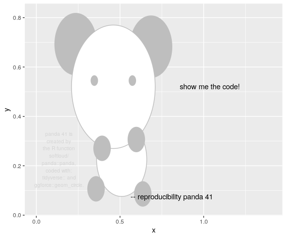

<!-- README.md is generated from README.Rmd. Please edit that file -->

<!-- badges: start -->

[](https://travis-ci.org/softloud/varameta)
<!-- badges: end -->

# varameta

The goal of `varameta` is to provide a solution to meta-analysing
medians. Existing solutions either convert medians to means, or omit the
studies that report medians. `varameta` provides all existing methods,
including a new esitmator for the variance of the sample median,
enabling meta-analysis of medians.

This package has some [secondary objectives](#secondary-objectives),
however, for the creator. As my first foray into reproducible packaged
analyses, version control with git, and package development, much that
is pedestrian in `varameta` was dazzlingly fascinating in its novelty.

## installation

You can install varameta from github with:

``` r
# install.packages("devtools")
devtools::install_github("softloud/varameta")
```

# A minimal demonstration of calculating the variance of the sample median

``` r
# packages
library(panda) # for panda
library(tidyverse)
library(simeta) # for sim_stats
library(varameta) 

# for reproducibility
set.seed(39)
```

``` r
panda("show me the code!")
#> Set panda = 41 to reproduce this panda.
```



## Compute standard error of the sample median

``` r

sample_size <- 30

# get a sample
a_sample <- rexp(sample_size)

# get standard error of the sample median
effect_se(
  centre = median(a_sample),
  spread = IQR(a_sample),
  n = length(a_sample),
  centre_type = "median",
  spread_type = "iqr"
)
#> [1] 0.1093218
```

## Vectorised calculations for dataframes

Here we borrow a function from the companion `simeta::` package. See
below for details.

``` r
# generate random meta-analysis dataset
# one row per study

(ma_sample <- sim_stats() %>%
  # filter down to one group per study
  dplyr::filter(group == "control"))
#> # A tibble: 3 x 5
#>   study   group   effect effect_spread     n
#>   <chr>   <chr>    <dbl>         <dbl> <dbl>
#> 1 study_1 control   49.3         0.272    32
#> 2 study_2 control   50.2         0.241    71
#> 3 study_3 control   59.0         0.313    37


ma_sample %>%
  # append a column with the standard error of the median for each study
  mutate(effect_se = pmap_dbl(
    list(centre = effect,
         spread = effect_spread,
         n = n),
    effect_se,
    centre_type = "median",
    spread_type = "iqr"
  ))
#> # A tibble: 3 x 6
#>   study   group   effect effect_spread     n effect_se
#>   <chr>   <chr>    <dbl>         <dbl> <dbl>     <dbl>
#> 1 study_1 control   49.3         0.272    32    0.0447
#> 2 study_2 control   50.2         0.241    71    0.0266
#> 3 study_3 control   59.0         0.313    37    0.0477
```

### packaged analyses

This was the first time I really (figuratively) cracked open the
canonical [*R packages*](http://r-pkgs.had.co.nz/).

As someone who has built [towering
pillars](https://ropensci.org/blog/2018/03/13/ode-to-testing/) of script
files, it was quite the revelation to switch to storing my functions
reproducibly *with* documentation.

Unit [testing as a
debugging](http://cantabile.rbind.io/2018/07/01/testing-as-debugging/)
tool, was also a highlight discovery.

> “If you’re using automated testing, this is also a good time to create
> an automated test case. If your existing test coverage is low, take
> the opportunity to add some nearby tests to ensure that existing good
> behaviour is preserved. This reduces the chances of creating a new
> bug.” ([*Advanced
> R*](http://adv-r.had.co.nz/Exceptions-Debugging.html))

### git

A doctorate is a grand time of firsts. First package, first paper, first
conference talk, and first collaboration. Suddenly sharing my code,
collaborating on it, and tracking large projects are pressing concerns.

Learning git via the entertaining [*Happy Git and GitHub for the
useR*](http://happygitwithr.com/) was the solution I went with. A
[frustrating learning
curve](https://stackoverflow.blog/2017/05/23/stack-overflow-helping-one-million-developers-exit-vim/)
at times; e.g.,

``` bash
git config --global core.editor "nano"
```

is a command I wish I learnt a lot earlier. I’m convinced that vim was
designed by [GLaDOS](https://en.wikipedia.org/wiki/GLaDOS).


